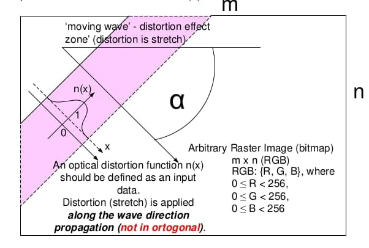

# flat-wave-animation
This repository contains flat surface "wave" animation mini-project.

## Assignment
Imagine,... you are observing a picture on the bottom of a borderless aquarium through a rectangular hole.<br>
Periodically you can see a flat wave spreading over the surface of water.<br>
Task is:
1. to simulate a smooth flat wave visual effect with a proper algorithm (as much
realistic as possible)
2. to optimize it for multi-core environment (_optional_)



### Basic requirements
0. The result should be a Win64 application (In C or C++ optimally, Java / Python are also acceptable).
1. It should get A background image as an input (BMP, JPEG, etc).
2. The application has to provide a way for tuning parameters of wave animation (e.g. speed of propagation, etc) and mean for distortion function n(x).
3. The angle α has random value for every pass of wave (0 < α < 360), for first pass it must be 45 o (direction must be as shown on the figure above).
4. Every pass of the wave animation has to start from random corner pixel of the background image.
5. The application has to provide switching between parallel and sequential animation mode (optional).
6. Any external 3D libraries (OpenGL, etc) must not be used.

Two variants have to be implemented:
1. sequential algorithm;
2. parallelized algorithm (optional);

## Implementation

### Key points
0. According to language requirements, I used **Java** to implement the program. My choice is based on the simplicity of developing a multi-threaded application and graphical user interface.
1. At the beginning of the program there are a default background image that can be changed by clicking on **"Select image..."** button.
2. Under image panel there are several tuning parameters: speed of propagation, animation delay and radius of distortion.
3. Also, you are able to switch between parallel and sequential mode before start animation.
4. Above image panel you can monitor iteration number, angle value and corner start position where 'wave' animation should start.

### How to run this project ?
1. Using Intellij IDEA: 
    + open Intellij IDEA
    + click on **"Open or import"** button
    + select current project and wait few seconds to load it
    + click on **"Run"** button
2. Using Java CLI:
    + open your console in root directory of current project
    + enter following command to run application:
        ```bash
        java -jar out/artifacts/flat_wave_animation_jar/flat-wave-animation.jar
        ```

### Algorithm description
1. Sequential algorithm 
    + Define start corner position, from which wave animation will start, and angle at which the wave will propagate. For the first iteration angle value equals 45 degree, for next - random angle value.   
    + The wave has a shape of line. This conditional line is constructed on the image panel.
    + Points, that are located on this line, are considered key points.
    + According to angle value, define step for painting of key points and step for propagation.
    + Use distortion function to blur points that are within in a certain radius of key points.
    + As a distortion function I tried to use such variants:
        - Linear pixel offset (stretching). This variant resembled a water transfusion, but it is quite straightforward and its artificial nature is noticeable.
        - Gaussian blur. This algorithm is more complex in implementation (need to compute kernels) and shows worse simulation of wave propagation. 
      These options have many disadvantages, so I pick up own function manually:
        - Custom variant. This algorithm is the golden mean. It is simple in realization and most similar to water transfusion. Distortion function has the following formula:
        X =
        Y =
   + Drawing a picture after applying distortion function.
   + In a case when all key points are outside the picture - go to the next pass (iteration).
      
2. Parallel algorithm
    + Parallel version of program is a similar to sequential, but distortion function is applied using pool of threads that significantly speeds up the calculation and make wave transfusion smoother.
    + For implementation of parallel algorithm was used ForkJoinPool Framework. It provides greater speed through the use of the work-stealing algorithm: threads that are free can steal work from other busy threads.

### Specifics: 
+ Since the angle takes the range **from 0 to 360 degree** randomly, so in some cases wave propagation may go away from the image. If it happens, the image will have no key points, and we will go to the next iteration.

### Algorithm comparison
To compare parallel version of algorithm with sequential one, I have used "speedup" metric:
<br>
With default parameters parallel algorithm shows speedup in **1.33**. 

### Demonstration
llll

## Sources
+ [The Java Tutorials Lesson: Concurrency](https://docs.oracle.com/javase/tutorial/essential/concurrency/index.html)
+ [Foster I. Designing and Building Parallel Programs](http://www.mcs.anl.gov/~itf/dbpp/text/book.html)